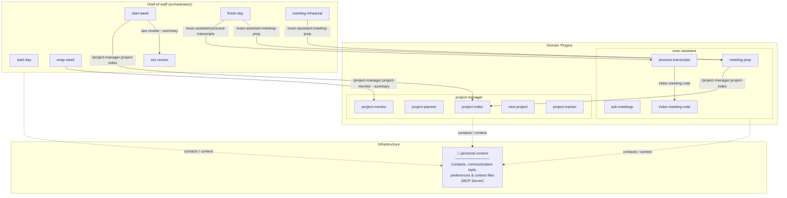

# Chief of Staff

Your strategic operating layer for Claude Code. The chief of staff doesn't handle your calendar or draft your emails — that's the exec-assistant's job. The CoS protects your **priorities**: surfacing what matters, recommending where to focus, flagging patterns you can't see from inside the week, and making sure what you say is important actually gets treated that way.

A human chief of staff operates at the 90-day to annual horizon — setting the conditions for the work, not doing it. They come to conversations with a point of view. They tell you when something isn't working. They act as an honest broker between what you intend and what you're actually doing with your time.

That's the posture this plugin takes:

- **An EA protects your time.** The exec-assistant handles that — meetings, email, transcripts, logistics.
- **A CoS protects your priorities.** That's this plugin — planning, pattern recognition, alignment, and strategic prep.

The CoS doesn't replace your judgment. It does the synthesis so you can exercise judgment on what matters, not on what to look at first.

---

## Architecture

Chief of Staff is an orchestration layer. It doesn't own project data or meeting memory — those belong to domain plugins that know how to manage them. Chief of Staff knows *when* and *why*; the domain plugins know *how*.



**How the layers relate:**

- `personal-context` is infrastructure — identity, preferences, and contacts used by everything else
- `exec-assistant` is the EA layer — owns actions on meetings, email, and transcripts; runs logistics
- `project-manager` is the project layer — owns project schemas, plans, and health monitoring
- `chief-of-staff` is the strategic layer — reads from all of the above, coordinates them, but owns none of their data

Both the CoS and the EA can read your calendar, tasks, and email directly from the MCP servers. Only the EA takes actions on them (scheduling, drafting, filing). The CoS reads to interpret and recommend; the EA reads to act. That's the separation.

---

## How the Skills Work Together

The skills form a weekly operating rhythm — but the rhythm is a means, not an end. The point is that the CoS comes to each session with data already synthesized and a recommendation already formed, so your job is judgment and correction rather than assembly.

```
Monday morning     → /start-week        Recommends 2–3 weekly priorities based on deadlines, AOR health, and carry-forward.
                                         You refine, not start from scratch. Surfaces a time audit against your calendar.

Each morning       → /start-day         Leads with a focus recommendation: what to work on during which windows, and why.
                                         Then surfaces the supporting context (email, tasks, meetings).

Each evening       → /finish-day        Reviews the day, surfaces delegation candidates for the EA, reschedules what
                                         didn't happen, preps tomorrow's meeting notes, processes today's transcripts.

As needed          → /meeting-rehearsal  Strategic coaching before high-stakes meetings: outcome framing, objection
                                         anticipation, weak spot identification. Reads the EA prep brief as input.

As needed          → /think             Ad-hoc CoS conversation for any topic — trade-offs, prioritization, framing,
                                         decisions. Loads week priorities and today's focus; can pull from project
                                         research stores. Use when you want the CoS hat without a full workflow.

Throughout week    → /aor-review        Reviews each Area of Responsibility for stagnation, overdue tasks, and patterns
                                         that suggest a project needs to spin up. Runs silently inside /wrap-week.

Friday afternoon   → /wrap-week         Reads the last 3–4 weekly recaps to surface cross-week patterns before planning.
                                         Recommends next week's priorities. Recaps this week. Creates next week's file.
```

**The strategic layer in practice:** `/start-week` doesn't ask "what do you want to work on?" — it reads your projects, AOR health, and last week's recap and says "here's what I'd prioritize, here's why — what would you change?" `/wrap-week` doesn't just recap this week; it notices that the strategy doc has been on the list for four weeks without moving and says so. `/start-day` doesn't just list your meetings; it tells you which gap to use for priority #1 and surfaces the context from last week's 1:1 before you walk in.

**What the CoS doesn't do:** It doesn't make decisions. It doesn't act on your calendar, inbox, or tasks — that's the exec-assistant. It surfaces, recommends, and surfaces patterns. You're still the decider. That's the right boundary for now, and it's where a human CoS earns trust before getting more authority: through demonstrated judgment over time.

**Orchestration plumbing:** `/finish-day` automatically calls `/exec-assistant:process-transcripts` and `/exec-assistant:meeting-prep` so meeting notes are processed and tomorrow's prep is ready. `/wrap-week` silently calls `/project-manager:project-monitor --summary` and `/aor-review --summary` before priority-setting so it arrives with context, not questions. `/start-week` calls `/aor-review --summary` for the same reason.

---

## Prerequisites

All skills require MCP servers for calendar, tasks, email, and vault access. Set them up once and they persist in your Claude Code user config.

### 1. Todoist

Register the official Todoist MCP server globally in Claude Code:

```bash
claude mcp add --transport http --scope global todoist https://ai.todoist.net/mcp
```

Claude Code will prompt you to authenticate with Todoist the first time a tool is called.

### 2. Google Calendar

**Step 1:** Create a Google Cloud project and enable the Google Calendar API.
Follow the authentication guide at: https://github.com/nspady/google-calendar-mcp#authentication

Download your OAuth credentials JSON file (e.g., to `~/gcp-oauth.keys.json`).

**Step 2:** Register the MCP server:
```bash
claude mcp add --transport stdio \
  --env GOOGLE_OAUTH_CREDENTIALS=$HOME/gcp-oauth.keys.json \
  google-calendar --scope user \
  -- npx -y @cocal/google-calendar-mcp
```

The first time Claude Code uses this server it will open a browser for OAuth consent.

### 3. Gmail

`/start-day` and `/finish-day` check for unread emails labeled `Priority/p1` or `Priority/p2`. Any Gmail MCP server that supports label-based search works. One option using the community `@gptscript-ai/gmail-mcp` server:

```bash
claude mcp add --transport stdio \
  --env GOOGLE_OAUTH_CREDENTIALS=$HOME/gcp-oauth.keys.json \
  gmail --scope user \
  -- npx -y @gptscript-ai/gmail-mcp
```

Set up `Priority/p1` and `Priority/p2` labels in Gmail and apply them to emails that need your attention. The skills search for `label:Priority/p1 OR label:Priority/p2 is:unread` — adjust the query format to match your MCP server's API.

If Gmail MCP is unavailable, both skills degrade gracefully and note that email data was skipped.

### 4. Personal Context

The `personal-context` plugin is a separate installation that provides contact resolution and personal preference files to all plugins. Install it independently — see the `personal-context` plugin README for setup instructions.

### 5. Exec-Assistant and Project Manager

`/finish-day` and `/wrap-week` call into the `exec-assistant` and `project-manager` plugins. Install both for the full operating cycle:

- `exec-assistant` — meeting prep, transcript processing, meeting memory, email prioritization
- `project-manager` — project plans, health monitoring, project index

---

## Obsidian Vault Setup

The chief of staff assumes a particular structure to the Obsidian vault based on Tiago Forte's PARA system. Default paths can be overridden two ways: a `CLAUDE.md` config block in the vault root (applied every run), or per-invocation arguments (highest precedence).

### CLAUDE.md Configuration

Add a **Chief of Staff** section to your vault's `CLAUDE.md` to set persistent path defaults — no arguments needed on every invocation. All path-aware skills (across CoS, exec-assistant, and project-manager plugins) read this block on startup.

```markdown
## Chief of Staff
- projects-path: Projects
- daily-notes-path: Journal/Daily
- notes-path: Meetings
- weekly-recaps-path: Reviews/Weekly
- areas-path: Areas
```

| Key | Default | Used by |
|-----|---------|---------|
| `projects-path` | `01-Projects` | project-manager: `/new-project`, `/project-planner`, `/project-tracker`, `/project-index`, `/project-monitor`; exec-assistant: `/meeting-prep` |
| `daily-notes-path` | `02-AreasOfResponsibility/Daily Notes` | `/start-day`, `/finish-day`, `/wrap-week` |
| `notes-path` | `02-AreasOfResponsibility/Notes` | `/start-day`, `/finish-day`; exec-assistant: `/meeting-prep`, `/process-transcripts`; project-manager: `/project-monitor` |
| `weekly-recaps-path` | `02-AreasOfResponsibility/Weekly Recaps` | `/start-week`, `/start-day`, `/wrap-week` |
| `areas-path` | `02-AreasOfResponsibility` | `/wrap-week`, `/aor-review` |

Precedence: per-invocation argument > `CLAUDE.md` value > hardcoded default.

### Per-invocation Overrides

Any skill argument takes highest precedence for that run:

```
/start-day --daily-notes-path "Journal/Daily" --notes-path "Meetings"
/wrap-week --weekly-recaps-path "Reviews/Weekly"
```

The skills assume this folder structure in your vault:

```
vault/
├── 01-Projects/            ← one subfolder per *owned/led* project, each with a PLAN.md
│   ├── my-project/
│   │   ├── Notes/          ← Project specific notes
│   │   │   └── a-note.md
│   │   └── PLAN.md
│   ├── Watched/            ← one subfolder per *monitored* project, each with a PLAN.md
│   │   └── my-project/
│   │       └──PLAN.md
│   └── ...
├── 02-AreasOfResponsibility/
    ├── Daily Notes/        ← lightweight day hubs (created by /start-day)
    │   ├── 2026-03-30.md
    │   └── ...
    ├── Notes/              ← your existing meeting notes (untouched)
    │   ├── 1:1 with Alex.md
    │   ├── Team Standup.md
    │   └── ...
    └── Weekly Recaps/      ← narrative weekly summaries (created by /wrap-week)
        ├── 2026-W13.md
        └── ...
```

### Daily Notes
Enable the **Daily Notes** core plugin in Obsidian (Settings → Core Plugins → Daily Notes):
- Folder: `Daily Notes`
- Date format: `YYYY-MM-DD`
- Template: optional — `/start-day` will create notes with its own template


### Notes
The `Notes/` folder is where meeting notes are maintained. Files in this folder are never modified except to append new date sections for recurring meetings by `/finish-day`. No content is moved or duplicated.

### Projects
Every project has its own folder with at least a `PLAN.md` file that contains the plan overview. Notes specific to the project can be contained within a `Notes/` folder in the project. Projects that are of interest but not being directly led by the user go into sub-folders within `Watched/`. Projects are assumed to have a Todoist project named the same. The `/project-manager:new-project` skill will create a project folder, Todoist project and kick off the appropriate skill to generate the right PLAN.md file.

---

## Transcript Workflow

By default, `/finish-day` shows a checklist reminder to download transcripts and drop them in your n8n pickup folder.

If connected with an MCP server, processing can be automatically triggered by passing the server name to finish-day:

```
/finish-day --transcript-mcp n8n
```

---

## Skills Reference

These are the seven skills in the chief-of-staff plugin. For EA skills (`/meeting-prep`, `/process-transcripts`, `/email-prioritization`) see the `exec-assistant` plugin. For project skills (`/project-planner`, `/project-monitor`, `/new-project`) see the `project-manager` plugin.

| Skill                  | What the CoS does                                                                                                                                    | When to use                                            |
| ---------------------- | ---------------------------------------------------------------------------------------------------------------------------------------------------- | ------------------------------------------------------ |
| `/start-week`          | Reads projects, AOR health, and last week's recap — recommends 2–3 priority candidates with reasoning before asking you to set them. Audits calendar time against the priorities you choose. | Monday morning |
| `/start-day`           | Leads with a focus recommendation: which window to use, what to work on, why. Then surfaces supporting context (email, tasks, meetings, meeting notes). | Each morning before starting work |
| `/finish-day`          | Reviews the day, surfaces EA delegation candidates, reschedules incomplete tasks, triggers transcript processing, preps tomorrow's meeting notes.     | Each evening before logging off                        |
| `/wrap-week`           | Reads 3–4 prior weekly recaps to surface cross-week patterns before you plan. Recommends next week's priorities. Recaps this week. Creates next week's file. | Friday afternoon or Sunday evening               |
| `/aor-review`          | Reviews each Area of Responsibility for stagnation, task age, and clustering — surfaces areas that need attention or a project spun up.              | On demand mid-week; runs silently inside `/wrap-week`  |
| `/meeting-rehearsal`   | Coaching before high-stakes meetings: frames your win condition, surfaces likely objections, identifies weak spots, synthesizes an opening strategy. Reads the EA prep brief as input. | Before important meetings; surfaced during `/start-week` |
| `/think`               | Ad-hoc CoS conversation for any topic. Loads week priorities and today's focus context, then coaches through trade-offs, prioritization, framing, or decisions. Can draw on project research stores when evaluating options. | Any time you want the CoS hat without a full workflow |

### Arguments

**`/start-week`**
- `--weekly-recaps-path <path>` — Override weekly recaps folder (default: `02-AreasOfResponsibility/Weekly Recaps`)

**`/start-day`**
- `--daily-notes-path <path>` — Override default daily notes folder (default: `02-AreasOfResponsibility/Daily Notes`)
- `--notes-path <path>` — Override meeting notes folder (default: `02-AreasOfResponsibility/Notes`)

**`/finish-day`**
- `--daily-notes-path <path>` — Override default daily notes folder
- `--notes-path <path>` — Override meeting notes folder
- `--transcript-mcp <server-name>` — Name of an MCP server to trigger for transcript processing

**`/wrap-week`**
- `--daily-notes-path <path>` — Override default daily notes folder
- `--weekly-recaps-path <path>` — Override weekly recaps folder (default: `02-AreasOfResponsibility/Weekly Recaps`)
- `--areas-path <path>` — Override areas of responsibility root folder (default: `02-AreasOfResponsibility`)
- `--focus <text>` — Specify a theme or area to emphasize when setting next week's priorities

**`/aor-review`**
- `--areas-path <path>` — Override areas of responsibility root folder (default: `02-AreasOfResponsibility`)
- `--summary` — Run in silent summary mode (no interaction, structured output only — used by `/wrap-week`)

**`/meeting-rehearsal`**
- `--meeting <name>` — Meeting name or partial match (e.g., `"1:1 with Alex"`)
- `--date <YYYY-MM-DD>` — Meeting date (defaults to soonest upcoming match)
- `--notes-path <path>` — Override meeting notes folder (default: `02-AreasOfResponsibility/Notes`)

**`/think`**
- Free text after the command: `/think how should I handle the reorg conversation`
- `--topic <text>` — Explicit topic (alternative to free text)
- `--project <name>` — Scope research queries to a specific project (otherwise inferred from priorities or conversation)
- `--weekly-recaps-path <path>` — Override weekly recaps folder (default: `02-AreasOfResponsibility/Weekly Recaps`)
- `--daily-notes-path <path>` — Override daily notes folder (default: `02-AreasOfResponsibility/Daily Notes`)

---

## Tips

**The system only pays off if you route through it.** If `/start-day` surfaces three priorities and you immediately react to whatever's loudest in your inbox, the CoS doesn't do its job. The architecture works when you treat the recommendations as a starting point, not background noise.

**Run the full cycle for the first two weeks.** The skills compound. `/start-day` is better when it can read weekly priorities from `/start-week`. `/wrap-week` pattern recognition requires prior weekly recap files to exist. The first week feels lightweight; by week three it feels like a real operating system.

**Accept the recommendation, then redirect.** The CoS comes with a point of view — candidate priorities, focus windows, objections to anticipate. You don't have to accept it. But engage with the recommendation rather than ignoring it. "No, here's why" teaches you something; just skipping it doesn't.

**Cross-week patterns are the most valuable output.** Single-week observations are easy to dismiss. When `/wrap-week` says the same thing has been deferred three weeks running, that's a real signal. Either the item isn't as important as it seemed, or something is blocking it. Either answer is worth surfacing.

**Daily note as a hub.** Keep meeting content in your long-running `Notes/` files. Daily notes link to those notes and capture your intentions and reflections — no duplication.

**Todoist priority discipline.** The morning briefing ranks tasks by p1/p2. If everything is p1, the ranking loses meaning. Consider a rule: max 2–3 p1 tasks at any time.

**Calendar blocking.** `/start-week` can create `[IT]` focus blocks on your calendar. `/start-day` treats them as dedicated windows and recommends work for each. The blocks are marked Free so they don't prevent meeting scheduling — they're a signal to yourself, not a hard hold.

**Weekly recaps as a personal changelog.** ISO week filenames (`2026-W13.md`) sort naturally and are readable months later. They're the primary input for cross-week pattern recognition in `/wrap-week`.

**Run `/finish-day` before leaving, not after.** The meeting note prep for tomorrow works best while today's context is fresh. It also triggers transcript processing automatically — you don't have to remember.

**`/aor-review` runs silently inside `/wrap-week`.** You don't need to run it separately on Fridays. Run it independently mid-week when you want a focused check-in on area health without going through the full wrap-week flow.

**Use `/meeting-rehearsal` for anything where you'd normally just walk in.** The skill earns its keep on conversations where you have a clear agenda but haven't thought through what the other person's agenda might be, or where you know what you want to say but haven't pressure-tested it. The session takes 10–15 minutes and materially changes how you show up.
